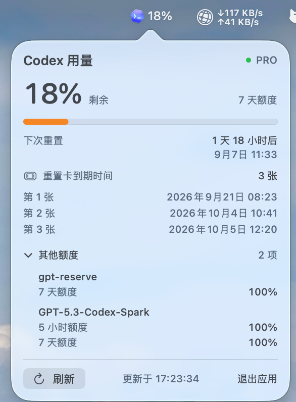

# Codex Usage for macOS

在 Mac 顶部菜单栏查看 Codex 剩余额度、重置时间和重置卡到期日期。

**[下载最新版](https://github.com/ccrrfftt/codex-usage-menubar/releases/latest)**

  

- **一眼查看用量**：菜单栏显示图标和剩余百分比，点击展开各项额度。
- **查看重置卡**：显示可用数量，以及每张卡的到期时间。
- **按供电状态刷新**：插电每 1 分钟，电池每 5 分钟；休眠、离线时暂停。

## 安装

需要 **Apple Silicon Mac、macOS 14+**，并已安装、登录 Codex / ChatGPT 桌面应用。

1. 下载并解压 `Codex-Usage-macOS-arm64.zip`。
2. 把 `Codex Usage.app` 拖进「应用程序」，双击打开。

**升级**：先退出旧版，再替换 App。**退出**：点击面板中的「退出应用」。**删除**：退出后把 App 移到废纸篓。

当前安装包使用本地签名，尚未经过 Apple 公证。

原生应用，无需网页、Python 或 API Key；只读查询额度，不发起模型请求、不使用重置卡。不自动设置开机启动。

---

[开发说明](DEVELOPMENT.md) · [更新记录](CHANGELOG.md) · [图标来源](Assets/README.md)

个人项目，非 OpenAI 官方应用。
